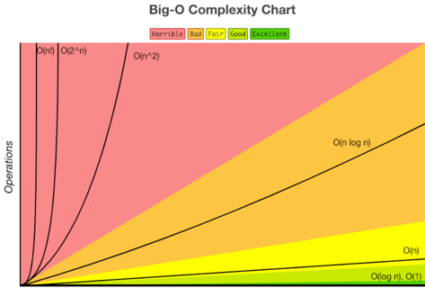

## 시간복잡도란? (Time Complexity)

알고리즘 문제를 풀 때 예상 입출력 케이스를 코드 실행으로 제출했을 때 효율성에서 시간 초과로 통과 못하는 경우가 있다.
내가 작성한 코드 실행시간은 어떻게 계산할까

입력값과 연산 수행 시간의 상관관계를 나타내는 척도를 시간복잡도라고 한다.

## 시간복잡도 표현방법
- 최상의 경우 : 오메가 표기법
- 평균의 경우 : 세타 표기법
- 최악의 경우 : 빅오 표기법

## 빅오 표기법 (Big-O) 
  

빅오 표기법은 불필요한 연산을 제거하여 알고리즘 분석을 쉽게 할 목적으로 사용된다.
시간복잡도는 입력된 N의 크기에 따라 실행되는 조작의 수를 나타낸다.
공간복잡도는 알고리즘이 실행될 때 사용하는 메모리의 양을 나타낸다.

- O(1) : 상수시간, 문제를 해결하는데 한 단계만 처리
- O(log n) : 로그시간, 문제를 해결하는데 필요한 단계들이 연산마다 특정 요인에 의해 줄어들음
- O(n) : 직선시간, 문제를 해결하는데 단계의 수와 입력값이 1:1관계
- O(n log n) : 선형로그형, 문제를 해결하는데 위한 단계의 수가 N*(log2N)번만큼의 수행시간을 가짐
- O(n^2) : 2차 시간, 문제를 해결하는데 단계의 수는 입력값의 제곱